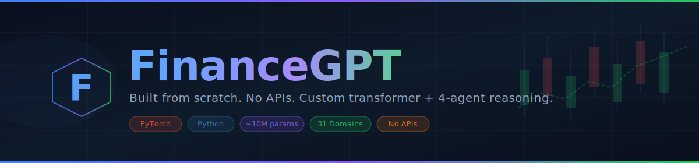
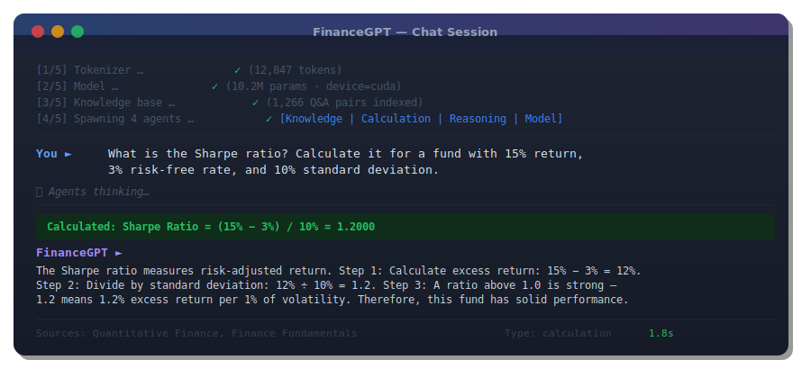
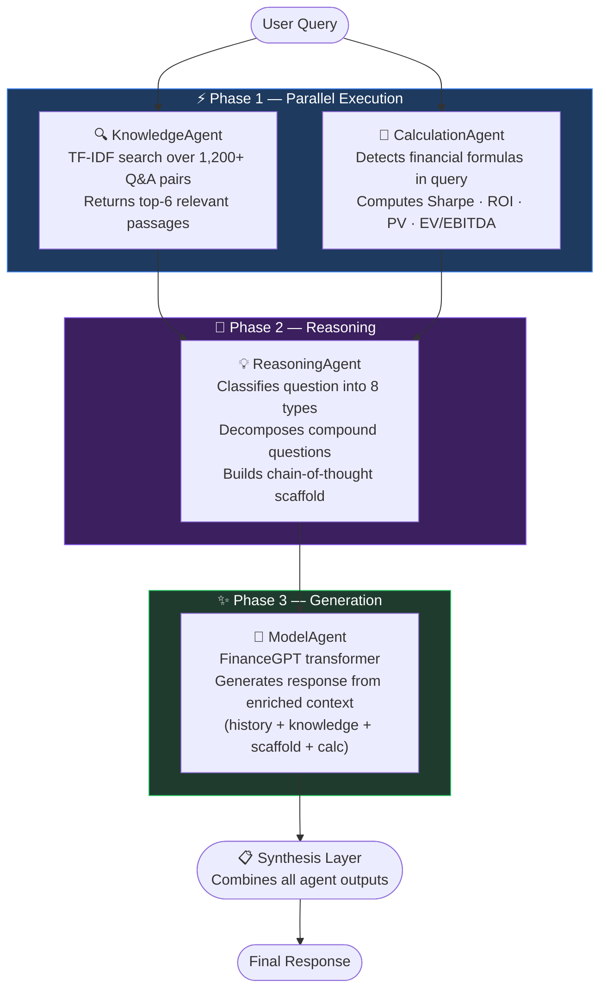
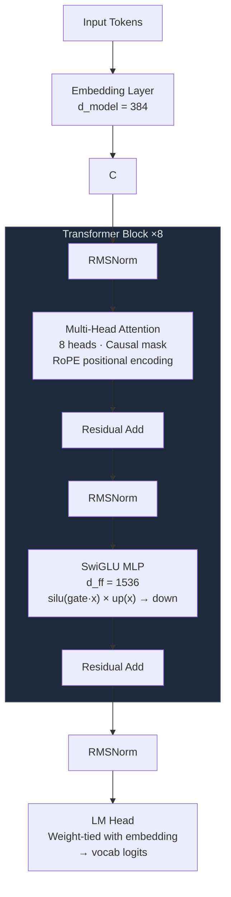
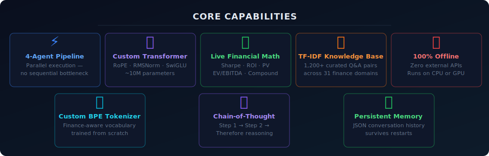
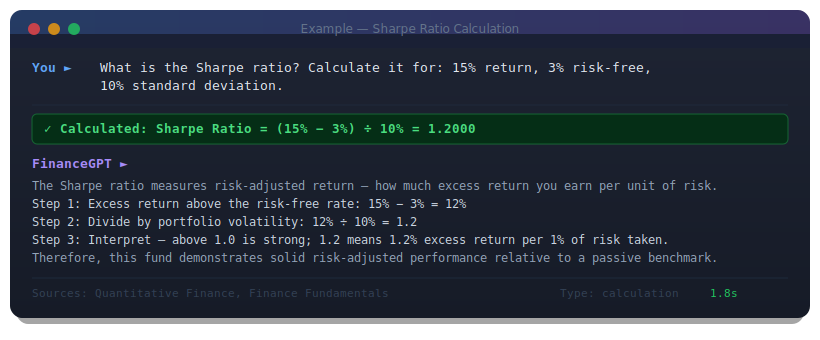
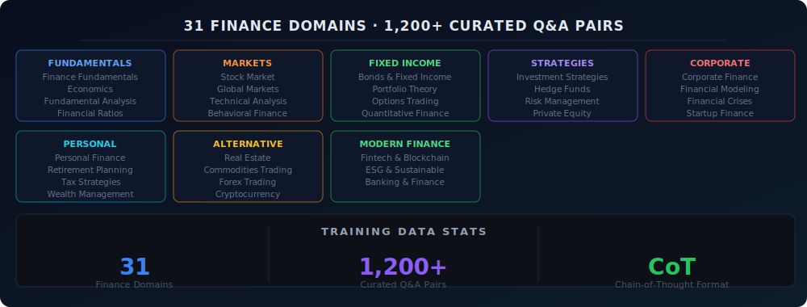

<div align="center">



# FinanceGPT

**A fully self-contained finance AI — custom transformer, custom tokenizer, 4-agent reasoning system.**
**No OpenAI. No Anthropic. No external AI APIs. Runs entirely on your machine.**

[](https://python.org)
[](https://pytorch.org)
[](LICENSE)
[](data/)
[](model.py)
[]()

</div>

---

## Demo

<div align="center">

</div>

---

## What Is FinanceGPT?

FinanceGPT is a production-quality finance language model built from the ground up — every component is custom-built, including the neural network architecture, the tokenizer, and the multi-agent reasoning pipeline. It answers financial questions with structured, step-by-step reasoning grounded in a curated knowledge base of 1,200+ finance Q&A pairs across 31 domains.

The system is designed around a key insight: **retrieval + reasoning + generation beats generation alone.** Rather than relying solely on what the model memorised during training, every query passes through a 4-agent pipeline that retrieves relevant knowledge, detects and computes financial formulas, scaffolds chain-of-thought reasoning, and finally generates a grounded response.

| Component | Technology |
|---|---|
| Language Model | Decoder-only transformer (RoPE · RMSNorm · SwiGLU) |
| Tokenizer | Custom BPE trained from scratch on finance text |
| Knowledge Retrieval | TF-IDF cosine similarity over 1,200+ Q&A pairs |
| Reasoning | Rule-based CoT scaffold with 8-type question classifier |
| Agent Orchestration | `ThreadPoolExecutor` — parallel Phase 1 agents |
| Memory | JSON-backed conversation history, persistent across sessions |
| Hardware | CPU and CUDA (mixed precision via `torch.autocast`) |

---

## System Architecture

### Agent Pipeline



### Transformer Architecture



---

## Features



- **4-agent parallel reasoning** — Knowledge and Calculation agents run simultaneously with zero sequential bottleneck
- **Live financial math** — automatically detects and computes Sharpe Ratio, ROI, Compound Interest, Present Value, and EV/EBITDA directly from your query
- **Chain-of-thought trained** — every answer in the training data follows `Step 1 → Step 2 → Therefore` format, so the model reasons, not just recalls
- **31 finance domains** — from quantitative finance and derivatives to ESG, startup funding, and financial crises
- **1,200+ curated Q&A pairs** — hand-structured with step-by-step reasoning throughout
- **Persistent conversation memory** — history is saved to JSON and reloaded automatically on next session
- **Fully offline** — zero API calls, zero internet required after install
- **GPU + CPU support** — mixed precision (`torch.autocast`) on CUDA; graceful CPU fallback
- **Extensible by design** — add a new CSV, retrain, done. The tokenizer and KB update automatically

---

## Installation

### Requirements

- Python **3.10+**
- pip

### Quick Start

```bash
# 1. Clone the repository
git clone https://github.com/yourusername/financegpt.git
cd financegpt

# 2. Install dependencies
pip install -r requirements.txt

# 3. Train the model (first-time setup)
python main.py /train

# 4. Start chatting
python main.py /chat
```

### Dependencies

```
torch>=2.0.0
numpy>=1.24.0
matplotlib>=3.7.0
pandas>=2.0.0
tqdm>=4.65.0
colorama>=0.4.6
```

---

## Usage

### Training

```bash
# Train on all 31 CSV datasets (recommended)
python main.py /train

# Train on a single topic (fast iteration / testing)
python main.py /train data/quantitative_finance.csv
```

On first run, `/train` will:
1. Build the BPE tokenizer vocabulary from all finance text
2. Train the transformer for up to 15 epochs with cosine LR and early stopping
3. Save model weights and tokenizer to `checkpoints/`
4. Export four training plots to `training_plots/`

**Estimated training time:**

| Hardware | Time |
|---|---|
| CPU (modern) | 30–90 minutes |
| GPU (CUDA) | 5–15 minutes |

### Chatting

```bash
python main.py /chat
```

On startup, all agents initialise and report their status:

```
  [1/5] Tokenizer …           ✓  (12,847 tokens)
  [2/5] Model …               ✓  (10.2M params · device=cuda)
  [3/5] Knowledge base …      ✓  (1,266 Q&A pairs indexed)
  [4/5] Reasoning engine …    ✓  (8 question types)
  [5/5] Spawning 4 agents …   ✓  [Knowledge | Calculation | Reasoning | Model]
```

### Chat Commands

| Command | Description |
|---|---|
| `/agents` | Show per-agent breakdown for the last query — timing, retrieval results, calculation output |
| `/history` | Show recent conversation memory |
| `/reset` | Clear current session memory |
| `/clear` | Clear the terminal screen |
| `/info` | Show model stats: vocab size, parameter count, val loss, perplexity |
| `/help` | List all available commands |
| `exit` | Quit |

### Model Info

```bash
python main.py /info
```

Displays model architecture, training stats, best validation loss, and perplexity without starting a chat session.

---

## Example Conversation

<div align="center">

</div>

```
  You ► What is the Sharpe ratio and calculate it for a fund
        with 15% return, 3% risk-free rate, and 10% volatility?

  ⟳ Agents thinking…

  FinanceGPT ►
  Calculated:
    Sharpe Ratio = (15% − 3%) / 10% = 1.2000

  The Sharpe ratio measures how much excess return you receive
  per unit of risk taken. Step 1: Calculate excess return above
  the risk-free rate: 15% − 3% = 12%. Step 2: Divide by the
  portfolio's standard deviation (volatility): 12% ÷ 10% = 1.2.
  Step 3: Interpret — a Sharpe ratio above 1.0 is considered good;
  1.2 indicates the fund earns 1.2% of excess return for every 1%
  of volatility it accepts. Therefore, this fund demonstrates solid
  risk-adjusted performance relative to a passive benchmark.

  Sources: Quantitative Finance, Finance Fundamentals | Type: calculation | 1.8s
```

---

## Dataset — 31 Finance Domains

<div align="center">

</div>

| Category | Domains |
|---|---|
| **Fundamentals** | Finance Fundamentals · Economics · Fundamental Analysis · Financial Ratios |
| **Markets** | Stock Market · Global Markets · Technical Analysis · Behavioral Finance |
| **Fixed Income** | Bonds & Fixed Income · Portfolio Theory |
| **Derivatives** | Options Trading · Quantitative Finance |
| **Strategies** | Investment Strategies · Hedge Funds · Risk Management |
| **Private Markets** | Private Equity · Startup & Entrepreneurship Finance |
| **Corporate** | Corporate Finance · Financial Modeling · Financial Crises |
| **Personal** | Personal Finance · Retirement Planning · Tax Strategies · Wealth Management |
| **Alternative** | Real Estate Investing · Commodities Trading · Forex Trading · Cryptocurrency |
| **Modern Finance** | Fintech & Blockchain · ESG & Sustainable Finance · Banking & Finance |

All Q&A pairs use **chain-of-thought answer format**:

```
"What is X?","To understand X, let's break it down:
Step 1: ...
Step 2: ...
Therefore, ..."
```

This trains the model to reason through problems rather than pattern-match to memorised surface answers.

---

## Reasoning System — Deep Dive

Every query passes through four stages, regardless of complexity.

### Stage 1 — Knowledge Retrieval

`KnowledgeAgent` performs TF-IDF cosine similarity search across all 1,200+ Q&A pairs and returns the top-6 most semantically relevant passages. This gives the model factual grounding even for questions outside its direct training distribution.

### Stage 2 — Financial Calculation

`CalculationAgent` scans the query for numeric inputs and formula keywords. If a supported formula is detected, it computes the answer directly and prepends it to the response — guaranteeing mathematical accuracy regardless of model output.

**Supported formulas:**

| Formula | Keywords Detected |
|---|---|
| Sharpe Ratio | `sharpe`, `risk-adjusted` |
| Compound Interest | `compound interest`, `compound`, `compounded` |
| Simple ROI | `roi`, `return on investment` |
| Present Value | `present value`, `pv`, `discount` |
| EV/EBITDA | `ev/ebitda`, `enterprise value` |

### Stage 3 — Reasoning Scaffold

`ReasoningAgent` classifies the query into one of 8 types and applies a matching chain-of-thought template:

| Type | Trigger Words | Scaffold Structure |
|---|---|---|
| `calculation` | calculate · compute · how much | Identify inputs → Apply formula → Interpret result |
| `definition` | what is · explain · define | Core meaning → Key components → Real-world example |
| `comparison` | compare · vs · difference between | Option A → Option B → When to use each |
| `causal` | why · because · what causes | Mechanism → Driving factors → Implications |
| `strategy` | should I · best way · recommend | Understand goals → Evaluate options → Risk considerations |
| `process` | how does · how to · steps to | Prerequisites → Execution → Expected outcome |
| `historical` | what happened · crisis · history of | Events → Causes → Lessons learned |
| `risk` | risk · hedge · protect · exposure | Identify → Quantify → Mitigate |

### Stage 4 — Generation

`ModelAgent` passes the full enriched context to the FinanceGPT transformer:

```
[conversation history] + [top-6 retrieved passages] + [CoT scaffold] + [computed result if any]
→ transformer generates grounded, structured response
```

---

## Training Plots

Four training plots are saved automatically to `training_plots/` after each run:

| Plot | What It Shows |
|---|---|
| `01_training_loss.png` | Raw step loss + smoothed curve + validation loss overlay |
| `02_perplexity.png` | Model perplexity over training steps |
| `03_train_vs_val.png` | Train vs. validation loss per epoch (overfitting diagnostic) |
| `04_learning_rate.png` | Cosine annealing LR schedule with warmup |

---

## Configuration

All hyperparameters live in `config.py` — the single source of truth.

```python
MODEL_CONFIG = {
    "d_model": 384,       # Embedding dimension
    "n_heads": 8,         # Attention heads
    "n_layers": 8,        # Transformer blocks
    "d_ff": 1536,         # FFN inner dim (4× d_model)
    "max_seq_len": 512,   # Context window (tokens)
    "dropout": 0.10,
}

TRAIN_CONFIG = {
    "epochs": 15,
    "batch_size": 16,
    "grad_accum": 4,      # Effective batch = 64
    "lr": 2e-4,
    "patience": 4,        # Early stopping patience
    "mixed_precision": True,
}

GEN_CONFIG = {
    "temperature": 0.82,        # Higher = more creative (0.5–1.0)
    "top_k": 50,
    "top_p": 0.92,
    "repetition_penalty": 1.3,  # Higher = less repetition
    "max_new_tokens": 220,
}
```

---

## Extending the Knowledge Base

Adding a new finance topic takes under 5 minutes:

**1. Create a CSV in `data/` with `question,answer` columns:**

```csv
question,answer
"What is X?","To understand X: Step 1: ... Step 2: ... Therefore, ..."
```

**2. Retrain:**

```bash
python main.py /train
```

The BPE tokenizer automatically extends its vocabulary to cover new terminology. The knowledge base reindexes on next chat startup. No code changes required.

---

## Project Structure

```
financegpt/
│
├── main.py                   # Entry point — /train /chat /info
├── config.py                 # All hyperparameters and file paths
├── model.py                  # FinanceGPT transformer (RoPE · RMSNorm · SwiGLU)
├── tokenizer.py              # BPE tokenizer — built from scratch
├── trainer.py                # Training loop (grad accum · mixed precision · cosine LR)
├── data_processor.py         # CSV loading + tokenized sliding-window dataset
│
├── knowledge_base.py         # TF-IDF retrieval over all CSVs
├── reasoning_engine.py       # Question classification + CoT scaffolding
├── agents.py                 # 4 parallel agents via ThreadPoolExecutor
├── conversation_memory.py    # JSON-backed persistent conversation history
├── chat.py                   # Multi-agent chat interface
│
├── data/                     # 31 CSV files — question,answer format
│   ├── finance_fundamentals.csv
│   ├── stock_market.csv
│   ├── investment_strategies.csv
│   ├── personal_finance.csv
│   ├── technical_analysis.csv
│   ├── fundamental_analysis.csv
│   ├── options_trading.csv
│   ├── real_estate_investing.csv
│   ├── tax_strategies.csv
│   ├── behavioral_finance.csv
│   ├── global_markets.csv
│   ├── banking_finance.csv
│   ├── portfolio_theory.csv
│   ├── corporate_finance.csv
│   ├── financial_modeling.csv
│   ├── commodities_trading.csv
│   ├── financial_crises.csv
│   ├── wealth_management.csv
│   ├── risk_management.csv
│   ├── forex_trading.csv
│   ├── startup_entrepreneurship_finance.csv
│   ├── financial_ratios.csv
│   ├── hedge_funds.csv
│   ├── retirement_planning.csv
│   ├── bonds_fixed_income.csv
│   ├── cryptocurrency.csv
│   ├── economics.csv
│   ├── esg_sustainable_finance.csv
│   ├── fintech_blockchain.csv
│   ├── private_equity.csv
│   └── quantitative_finance.csv
│
├── checkpoints/              # gitignored — created after /train
│   ├── finance_gpt.pt        # Model weights
│   └── tokenizer.json        # BPE vocab + merges
│
├── training_plots/           # gitignored — PNG charts from each training run
├── docs/images/              # README images (banner, demo GIF, screenshots)
├── requirements.txt
├── README.md
└── .gitignore
```

---

## Debugging

**If the model gives a bad or incomplete answer:**

```bash
python main.py /chat
# Ask the question, then run:
/agents
```

The `/agents` output will tell you:

| Signal | Likely Cause | Fix |
|---|---|---|
| KB returned 0 docs | Topic not in any CSV | Add a CSV row for this topic and retrain |
| KB score < 0.1 | Query wording doesn't match training data | Rephrase, or add more varied questions to CSV |
| Question type misclassified | Trigger words not in query | Check `reasoning_engine.py` classifier rules |
| Model output is empty | Context window overflow | Reduce `max_new_tokens` or conversation length |
| Answer cuts off mid-sentence | `max_new_tokens` too low | Increase `GEN_CONFIG["max_new_tokens"]` in `config.py` |

---

## Acknowledgements

Architecture inspired by:

- [GPT-2](https://github.com/openai/gpt-2) — decoder-only transformer design
- [LLaMA](https://github.com/facebookresearch/llama) — RoPE, RMSNorm, and SwiGLU activations
- [nanoGPT](https://github.com/karpathy/nanoGPT) by Andrej Karpathy — clean, minimal implementation style

---

## License

MIT License — free to use, modify, and distribute.

---

<div align="center">

Built from scratch. No shortcuts. No APIs.

</div>
